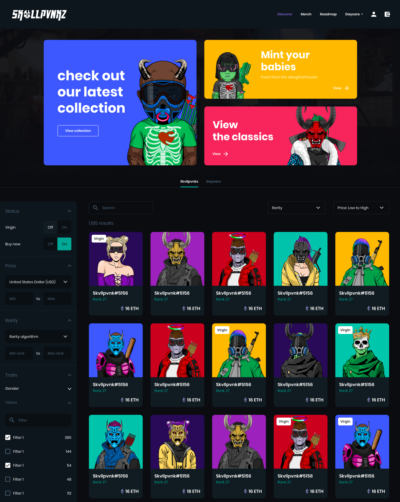

# Hideout Market

The Hideout Market is a trading platform that empowers holders to buy and sell Skvllpvnkz NFTs, items, cosmetic transformations and Hideout boosts. The market will initially support trading of Skvllpvnkz Hideout & Skvllbabiez collections, and will support the new collections when introduced. Eventually the market will be populated with items listed by you, the holders. The possibility for items to be listed by the developers in the form of consumables, buffs and/or rare speciality items will also be present. The Hideout Market will use $AMMO and Ethereum as its main currencies and profits from the Market will be distributed between the treasury and community wallet.

 

